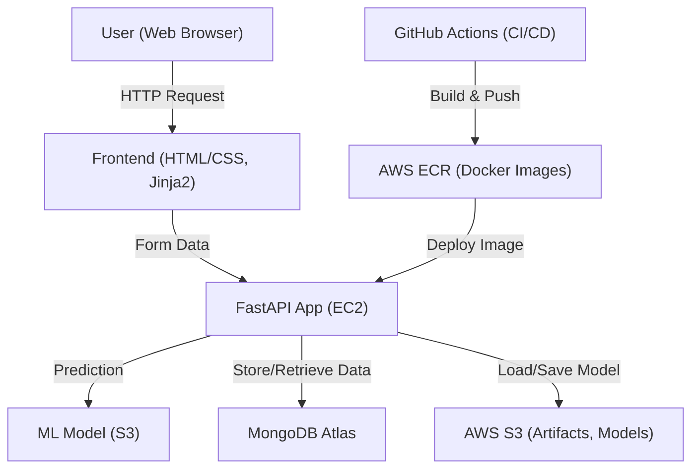

# Vehicle Insurance Data Pipeline

A robust, end-to-end MLOps project for automating vehicle insurance prediction using modern data engineering, machine learning, cloud, and DevOps best practices.

---

## 🚀 Features

- **Automated Data Ingestion, Validation, Transformation, and Model Training**
- **Production-Ready Model Serving with FastAPI**
- **Interactive Frontend for User Input and Prediction**
- **Cloud-Native Storage and Deployment (AWS S3, EC2, ECR)**
- **CI/CD with GitHub Actions for seamless integration and deployment**
- **Containerized with Docker for portability and scalability**

---

## 🛠️ Technologies Used

### Machine Learning & Data Science

- **Python 3.10**
- **Pandas, NumPy, Scikit-learn, Imbalanced-learn**: Data processing, feature engineering, and model training
- **Matplotlib, Seaborn, Plotly**: Data visualization
- **Random Forest Classifier**: Core ML model
- **Jupyter Notebook**: Exploratory data analysis and prototyping

### Backend & API

- **FastAPI**: High-performance API for model serving and user interaction
- **Uvicorn**: ASGI server for running FastAPI
- **Pymongo**: MongoDB integration for data storage and retrieval
- **Jinja2**: Templating engine for dynamic HTML rendering

### Frontend

- **HTML/CSS (Jinja2 templates)**: User interface for data input and prediction results
- **Static assets**: Custom CSS for styling

### Cloud & DevOps

- **AWS S3**: Model and artifact storage
- **AWS EC2**: Compute for hosting the application
- **AWS ECR**: Docker image registry for container deployment
- **boto3**: AWS SDK for Python to interact with S3 and other AWS services

### CI/CD

- **GitHub Actions**: Automated build, test, and deployment pipeline
  - Build and push Docker images to ECR
  - Deploy application to EC2
  - Secure secrets management

### Containerization

- **Docker**: Containerizes the entire application for consistent deployment across environments

---

## 🗂️ Project Structure

```
Vehicle-Insurance-Data-Pipeline/
│
├── app.py                  # FastAPI application entry point
├── src/                    # Core source code (pipelines, components, utils)
│   ├── components/         # Data ingestion, validation, transformation, training, evaluation, pusher
│   ├── pipline/            # Training and prediction pipelines
│   ├── cloud_storage/      # AWS S3 integration
│   ├── configuration/      # AWS and MongoDB connection configs
│   ├── entity/             # Data and model entities
│   └── ...                 # Other modules (logger, exception, utils, etc.)
├── notebook/               # Jupyter notebooks for EDA and prototyping
├── config/                 # YAML config and schema files
├── static/                 # CSS and static assets
├── templates/              # Jinja2 HTML templates
├── requirements.txt        # Python dependencies
├── Dockerfile              # Docker build instructions
├── .github/workflows/      # GitHub Actions CI/CD workflows
└── .gitignore              # Excludes sensitive and unnecessary files
```

---

## ☁️ Cloud Architecture



---

## ⚙️ How It Works

1. **Data Pipeline**: Ingests, validates, transforms, and trains ML models on vehicle insurance data.
2. **Model Storage**: Trained models are serialized and stored in AWS S3.
3. **API Serving**: FastAPI serves predictions via a web form and REST endpoints.
4. **Frontend**: Users interact via a web UI built with Jinja2 templates and custom CSS.
5. **CI/CD**: GitHub Actions automates testing, Docker image builds, and deployment to AWS EC2 via ECR.
6. **Cloud Integration**: All secrets and credentials are managed securely via environment variables and GitHub secrets.

---

## 🧑‍💻 Getting Started

1. **Clone the repository**
2. **Set up environment variables** for AWS and MongoDB credentials
3. **Install dependencies**: `pip install -r requirements.txt`
4. **Run locally**: `python app.py` or with Uvicorn: `uvicorn app:app --reload`
5. **Build Docker image**: `docker build -t vehicle-insurance-app .`
6. **Deploy to AWS**: Use the provided GitHub Actions workflow for automated deployment

---

## 📦 Key Dependencies

- fastapi
- uvicorn
- pandas, numpy, scikit-learn, imblearn
- pymongo
- boto3, mypy-boto3-s3, botocore
- jinja2
- python-multipart
- matplotlib, seaborn, plotly

---

## 🤝 Contributing

Contributions are welcome! Please open issues or submit pull requests for improvements or bug fixes.

---

## 🛡️ Security

- **No credentials or secrets are stored in the repository.**
- All sensitive files and notebooks are gitignored.
- Use environment variables or GitHub secrets for all cloud and database credentials.

---

## 📄 License

This project is licensed under the MIT License. 